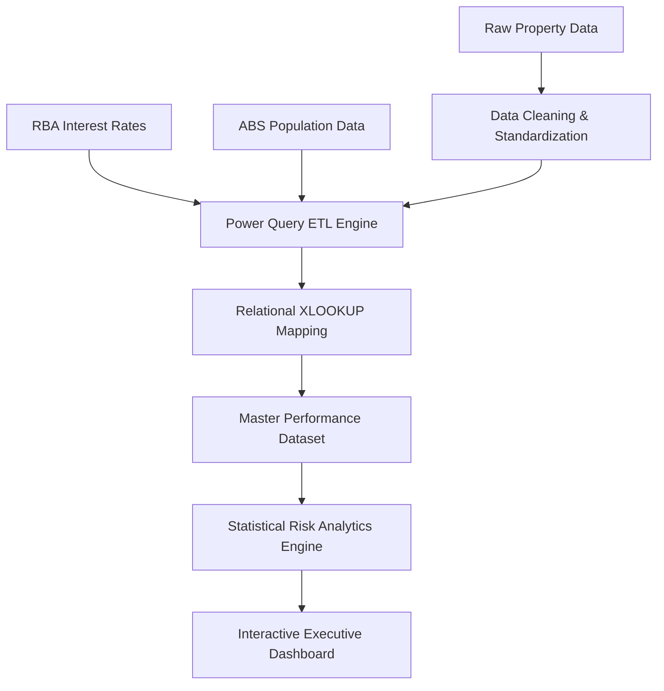

# Commercial Property Stress Testing
> **Commercial Property Investment Dashboard using Excel, Power Query, and Statistical Analysis**

An analytical model exploring the impact of Reserve Bank of Australia (RBA) cash rates and Australian Bureau of Statistics (ABS) population growth on a simulated commercial property portfolio (2016–2025).

---

## 📌 Project Overview
Commercial real estate performance is influenced heavily by macroeconomic conditions and localized demand metrics. This project integrates internal property asset records with public economic data to measure how shifting market landscapes influence investment returns, operational occupancy levels, and structural portfolio risk.

The final deliverable features an interactive **Excel Executive Dashboard** supported by a regression and correlation analysis engine, designed to pinpoint which property sectors demonstrate resilience during periods of economic tightening.

---

## 🎯 Business Intelligence Case

### The Problem
Commercial property investors operate under exposure to dual macroeconomic risks:
1. **Monetary Policy Risk:** Rising interest rates increase borrowing costs and compress investment yields.
2. **Demographic Shift Risk:** Geographic population volatility rapidly shifts demand across Office, Retail, and Industrial asset classes.

Traditional investment frameworks rely heavily on qualitative market intuition. This project demonstrates a data-driven approach to integrating historical economic indicators directly into property asset tracking to drive evidence-based capital allocation.

### Core Objectives
* 📊 **Interest Rate Sensitivity:** Quantify how commercial cap rates react to shifting RBA cash rates.
* 👥 **Demographic Impacts:** Evaluate if metropolitan population growth directly supports asset occupancy tiers.
* 🛡️ **Sector Resiliency:** Isolate the top-performing commercial asset class under active economic stress testing.
* 📈 **Capital Allocation:** Formulate data-driven frameworks for future commercial portfolio expansions.

---

## 📂 Data Architecture

The analytical model synthesizes three distinct datasets:

| Dataset | Type | Source | Description |
| :--- | :--- | :--- | :--- |
| **Simulated Property Portfolio** | Internal | Corporate Records | 36 commercial assets across Sydney, Melbourne, and Brisbane. |
| **RBA Historical Cash Rates** | External | Reserve Bank of Australia | Monthly historical interest rate tracking (2016–2025). |
| **ABS Regional Population** | External | Australian Bureau of Statistics | Annual population estimates filtered by Greater Capital Cities. |

### Technical Stack & Competencies
* **Data Engineering (ETL):** Microsoft Excel, Power Query, `XLOOKUP`, Relational Data Modelling, Schema Integration.
* **Analytics Engine:** Pivot Tables, Advanced Formulas, Linear Regression Models, Covariance Matrices, Pearson Correlation.
* **Data Visualization:** Interactive Slicers, Dashboard Design, Pivot Charts, Executive BI Reporting.

---

## 📁 Repository Structure

```text
Commercial-Property-Stress-Testing/
├── README.md
├── Commercial_Property_Model.xlsx
├── Documentation/
│   └── Technical_Report.pdf
├── Data/
│   ├── RBA_Cash_Rates.xlsx
│   └── ABS_Population.xlsx
└── Images/
    ├── Dashboard.png
    ├── Workflow.png
    └── Data_Model.png
```

---

## 🔄 Project Pipeline



### Relational Schema Blueprint
```text
  [Property Portfolio]
         │
         ├─── (Purchase Month) ────────> [RBA Cash Rate Table]
         └─── (Purchase Year/City) ────> [ABS Population Table]
                                               │
                                               ▼
                                   [Master Property Dataset]
                                               │
                                               ▼
                                    [Risk Analytics Engine]
                                               │
                                               ▼
                                 [Interactive Executive BI Dashboard]
```

---

## 🛠️ Data Engineering Process

### Step 1: Portfolio Structuring
Generated a structural portfolio tracking **36 commercial assets** acquired between 2016 and 2025. 
* **Asset Sectors:** Office, Retail, Industrial
* **Geographic Coverage:** Greater Sydney, Greater Melbourne, Greater Brisbane

### Step 2: Feature Engineering
Calculated core relational keys and target analytics fields:
* `Cap Rate`: Annualized property net operating income return profile.
* `Purchase Year`: Date anchor mapping annual ABS regional population metrics.
* `Purchase Month-Year`: Relational key mapping historical monthly RBA cash rate tiers.

### Step 3: ETL & External Data Integration
Using Power Query and normalized lookups, external government indicators were injected into each asset row based on its unique timeline and spatial metadata. This step synthesized disparate macroeconomic timelines into one standardized master analytical engine.

### Step 4: Financial KPI Formulation
Engineered core calculations across the master sheet:
$$\text{Capitalisation Rate} = \frac{\text{Net Operating Income}}{\text{Current Market Value}}$$
* Developed tracking fields for: **Yield Risk Spread**, **Occupancy Rate**, and **Vacancy Rate**.

### Step 5: Statistical Modelling
Applied data matrices to isolate asset behavior:
* **Volatility Analysis:** Standard Deviation tracking across asset Cap Rates.
* **Sensitivity Analysis:** Ordinary Least Squares (OLS) Linear Regression modeling.
* **Portfolio Diversification:** Covariance & Correlation matrix generation.

---

## 📊 Statistical Summary & Key Findings

### 1. Macroeconomic Sensitivity (Regression Model)
* **Goodness of Fit:** $R^2 = 13.09\%$
* **Insight:** RBA interest rates directly explain 13.09% of variance in portfolio cap rates. The remaining **86.91%** of performance variance is insulated and driven by operational factors (e.g., specific lease structures, tenant quality tiers, localized demand, and property management execution).

### 2. Sector Performance Matrix

| Commercial Sector | Avg. Cap Rate | Volatility (Std Dev) | Correlation (RBA Rate) | Occupancy Rate | Vacancy Rate | Risk Premium |
| :--- | :---: | :---: | :---: | :---: | :---: | :---: |
| **Office** | 6.00% | 0.34% | -56.54% | 86.0% | 14.0% | 4.01% |
| **Retail** | 6.27% | 0.16% | -45.35% | 91.3% | 8.7% | 4.31% |
| **Industrial** | 5.19% | 0.18% | -53.41% | 100.0% | 0.0% | 3.16% |

### Sector-Specific Insights
* 🏢 **Office Assets:** Suffered the highest structural risk profile. Experienced compression from rising borrowing costs paired with negative demand shift shocks induced by widespread hybrid corporate working trends.
* 🛍️ **Retail Assets:** Demonstrated high operational yield stability. Returns remained defended against macro volatility due to inflation-linked annual rental review rules embedded within traditional retail leases.
* 🏭 **Industrial Assets:** Achieved an optimal **100% occupancy rate** throughout the target time horizon. Driven structurally by macroeconomic tailwinds in e-commerce infrastructure expansion and urban logistics demands.

---

## 💼 Strategic Business Recommendations

1. 📉 **De-risk Office Allocation:** Reduce overall portfolio portfolio weight in multi-tenant commercial office buildings showing high structural vacancies or long-dated unhedged lease cycles.
2. 🏭 **Scale Industrial Logistics Assets:** Prioritize capital deployment toward industrial distribution sites and industrial parks positioned near high-growth demographic metropolitan nodes.
3. 📜 **Mandate Inflation-Linked Leases:** Structural underwriting guidelines for future asset acquisitions should require CPI-linked or aggressive fixed-step annual rental escalations to insulate returns against tightening monetary cycles.

---

## ⚠️ Assumptions & Limitations

* **Assumptions:** Portfolio data is synthetically generated for analytical modeling purposes. Historical RBA and ABS government indices are assumed to be fully accurate representations of actual market environments.
* **Limitations:** The underlying regression model isolates sensitivity metrics to primary interest-rate movements and population size; it does not factor in real-time localized competing supply pipelines or corporate tenant default risks.
